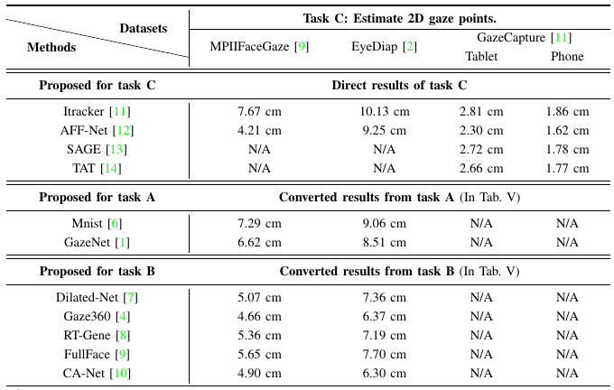

# Gaze-Net
The Pytorch Implementation of "MPIIGaze: Real-World Dataset and Deep Appearance-Based Gaze Estimation". (updated in 2021/04/28)

We build benchmarks for gaze estimation in our survey [**"Appearance-based Gaze Estimation With Deep Learning: A Review and Benchmark"**](https://arxiv.org/abs/2104.12668).
This is the implemented code of "Full-face" methods in our benchmark. Please refer our survey for more details.

We recommend you to use **data processing codes** provided in <a href="http://phi-ai.org/GazeHub/" target="_blank">*GazeHub*</a>.
You can direct run the method' code using the processed dataset.

## Links to gaze estimation codes.

- A Coarse-to-fine Adaptive Network for Appearance-based Gaze Estimation, AAAI 2020 (Coming soon)
- [Gaze360: Physically Unconstrained Gaze Estimation in the Wild](https://github.com/yihuacheng/Gaze360), ICCV 2019
- [Appearance-Based Gaze Estimation Using Dilated-Convolutions](https://github.com/yihuacheng/Dilated-Net), ACCV 2019
- [Appearance-Based Gaze Estimation via Evaluation-Guided Asymmetric Regression](https://github.com/yihuacheng/ARE-GazeEstimation), ECCV 2018
- [RT-GENE: Real-Time Eye Gaze Estimation in Natural Environments](https://github.com/yihuacheng/RT-Gene), ECCV 2018
- [MPIIGaze: Real-World Dataset and Deep Appearance-Based Gaze Estimation](https://github.com/yihuacheng/Gaze-Net), TPAMI 2017
- [It’s written all over your face: Full-face appearance-based gaze estimation](https://github.com/yihuacheng/Full-face), CVPRW 2017
- [Eye Tracking for Everyone](https://github.com/yihuacheng/Itracker), CVPR 2016
- [Appearance-Based Gaze Estimation in the Wild](https://github.com/yihuacheng/Mnist), CVPR 2015

## Performance
The method is evaluated in three tasks. Please refer our survey for more details.



## License
The code is under the license of [CC BY-NC-SA 4.0 license](https://creativecommons.org/licenses/by-nc-sa/4.0/).


## Introduction
We provide the code for the leave-one-person-out evaluation.

The project contains following files/folders.
- `model.py`, the model code.
- `train.py`, the entry for training.
- `test.py`, the entry for testing.
- `config.yaml`, this file is the config of the experiment. To run our code, **you should write your own** `config.yaml`. 
- `reader.py`, the data loader code. You should use suit reader for different dataset.

## Getting Started
### Writing your own *config.yaml*

Normally, for training, you should change 
1. `train.save.save_path`, The model is saved in the `$save_path$/checkpoint/`.
2. `train.data.image`, This is the path of image, please use the provided data processing code in <a href="http://phi-ai.org/GazeHub/" target="_blank">*GazeHub*</a>
3. `train.data.label`, This is the path of label.

For test, you should change 
1. `test.load.load_path`, it is usually the same as `train.save.save_path`. The test result is saved in `$load_path$/evaluation/`.
2. `test.data.image`, it is usually the same as `train.data.image`.
3. `test.data.label`, it is usually the same as `train.data.label`.
 
### Training

You can run
```
python train.py config.yaml 0
```
This means the code will run with `config_mpii.yaml` and use the `0th` person as the test set.

You also can run
```
bash run.sh train.py config.yaml
```
This means the code will perform leave-one-person-out training automatically.   
`run.sh` performs iteration, you can change the iteration times in `run.sh` for different datasets, e.g., set the iteration times as `4` for four-fold validation.


### Testing
You can run
```
python test.py config.yaml 0
```
or
```
bash run.sh test.py config.yaml
```

### Result
After training or test, you can find the result from the `save_path` in `config_mpii.yaml`. 


## Citation
If you use our code, please cite:
```
@ARTICLE{Zhang_2017_tpami,
	author={X. {Zhang} and Y. {Sugano} and M. {Fritz} and A. {Bulling}},
	journal={IEEE Transactions on Pattern Analysis and Machine Intelligence},
	title={MPIIGaze: Real-World Dataset and Deep Appearance-Based Gaze Estimation},
	year={2019},
	volume={41},
	number={1},
	pages={162-175},
	doi={10.1109/TPAMI.2017.2778103},
	ISSN={1939-3539},
	month={Jan}
}


@article{Cheng2021Survey,
        title={Appearance-based Gaze Estimation With Deep Learning: A Review and Benchmark},
        author={Yihua Cheng and Haofei Wang and Yiwei Bao and Feng Lu},
        journal={arXiv preprint arXiv:2104.12668},
        year={2021}
}
```

## Contact 
Please email any questions or comments to yihua_c@buaa.edu.cn.


## Reference

1. MPIIGaze: Real-World Dataset and Deep Appearance-Based Gaze Estimation
2. EYEDIAP Database: Data Description and Gaze Tracking  Evaluation Benchmarks
3. Learning-by-Synthesis for Appearance-based 3D Gaze Estimation
3. Gaze360: Physically Unconstrained Gaze Estimation in the Wild
5. ETH-XGaze: A Large Scale Dataset for Gaze Estimation under Extreme Head Pose and Gaze Variation
6. Appearance-Based Gaze Estimation in the Wild  
7. Appearance-Based Gaze Estimation Using Dilated-Convolutions
8. RT-GENE: Real-Time Eye Gaze Estimation in Natural Environments
9. It’s written all over your face: Full-face appearance-based gaze estimation
10. A Coarse-to-fine Adaptive Network for Appearance-based Gaze Estimation
11. Eye Tracking for Everyone
12. Adaptive Feature Fusion Network for Gaze Tracking in Mobile Tablets
13. On-Device Few-Shot Personalization for Real-Time Gaze Estimation
14. A Generalized and Robust Method Towards Practical Gaze Estimation on Smart Phone
